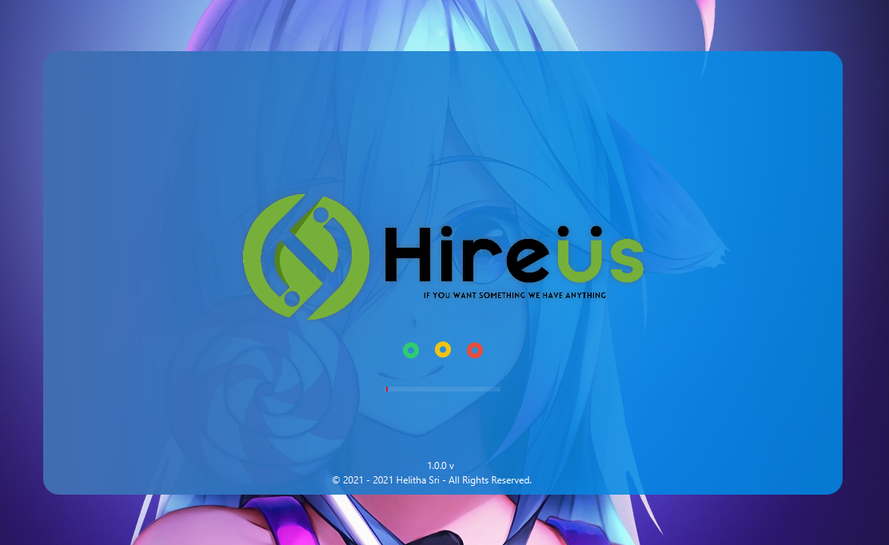

# Equipment-Rental-Shop
This is a Standalone Rental Management System. I designed and developed this application to manage all the internal process of the business; from this system, it could manage selling orders(like POS System) & Rented orders

.png)
.png)
.png)

## Cashier Functionalities
· View existing rental and sales items are displayed
· Rent and sell items
· Management of hired items
· History of renting items
· Customer management

## Admin Functionalities
· Financial, inventory, and customer reports
· Item management for rent and sale
· Manage item categories and models
· Manage users' rolls

## Tools & Technologies
· Java
· JavaFX
· CSS
· MySQL
· Jasper report